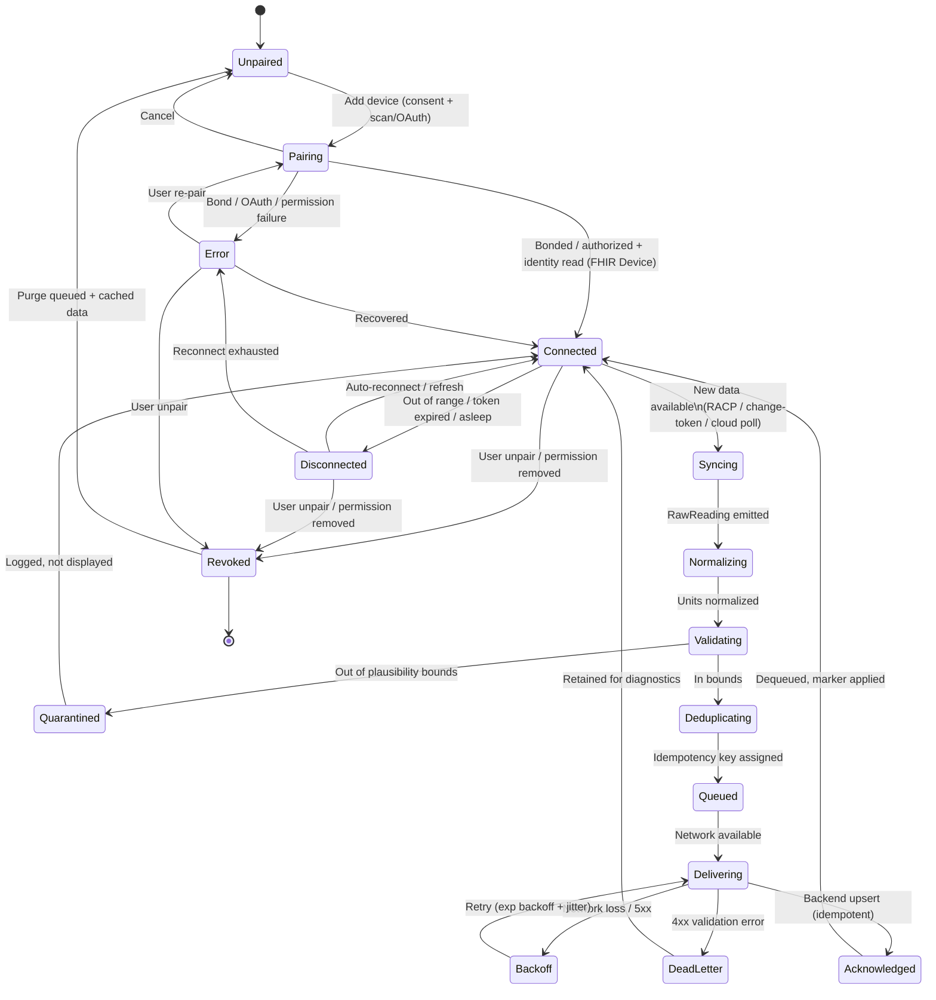

# Volume 5 — Medical Device Integration

_Part of the Diabetes Quest Specification Suite — Volume 5 of 10._

## Abstract

Diabetes Quest today is **self-report only**: the patient taps a logged action, and the
organ-impact simulation (`src/engine/physiology.ts`) moves the four markers it cares about
— blood glucose, systolic blood pressure, hydration, and LDL cholesterol. This volume
specifies how the platform graduates from manual entry to **trusted measured data** from
consumer and clinical medical devices, without compromising the safety-first framing the
product was built on.

The integration is deliberately conservative. Diabetes Quest is, and will remain through the
phases described here, an **educational application — not a medical device and not a closed-loop
therapy system**. Accordingly, every channel specified below is **read-only ingest**: the app
observes devices, it never commands them. Insulin pumps, smart pens, and any actuating therapy
device are explicitly **out of scope for write/control** in all early phases; where such devices
expose a read-only history (e.g. delivered-dose logs), only that history may be ingested, behind
an additional consent gate.

Three ingest channels are specified, in priority order: **Android Health Connect** as the primary
aggregation layer, **direct Bluetooth Low Energy (BLE)** for devices Health Connect does not yet
carry, and **vendor cloud APIs** (Dexcom, Abbott LibreView) where on-device BLE is restricted or
licensed. Every measurement is normalized into an **HL7 FHIR R4 `Observation`** keyed by LOINC,
flowing through the same backend ingest and sync contract defined in Volume 4 and surfacing to
clinicians per Volume 3. The design is HIPAA/GDPR-aware, follows OWASP guidance for the mobile
and transport surface, and treats every device reading as **untrusted input until validated**.

---

## Table of contents

1. [Overview & integration philosophy](#1-overview--integration-philosophy)
2. [Integration channels](#2-integration-channels)
3. [Supported device categories & data mapping](#3-supported-device-categories--data-mapping)
4. [BLE specifics: GATT, pairing, RACP](#4-ble-specifics-gatt-pairing-racp)
5. [Health Connect specifics](#5-health-connect-specifics)
6. [Device pairing UX & connection state machine](#6-device-pairing-ux--connection-state-machine)
7. [Synchronization & ingest pipeline](#7-synchronization--ingest-pipeline)
8. [Offline queue & conflict resolution contract](#8-offline-queue--conflict-resolution-contract)
9. [Device management & FHIR Device resource](#9-device-management--fhir-device-resource)
10. [Data quality, calibration & limitations](#10-data-quality-calibration--limitations)
11. [Future SDKs & device-certification checklist](#11-future-sdks--device-certification-checklist)
12. [Functional requirements](#12-functional-requirements)
13. [Connection & sync lifecycle diagram](#13-connection--sync-lifecycle-diagram)
14. [Traceability & cross-references](#14-traceability--cross-references)

---

## 1. Overview & integration philosophy

### 1.1 Why measured data, and why carefully

The simulation is intentionally simplified and **directionally faithful, not clinically
predictive**. Feeding it real measurements does not change that contract: a Dexcom glucose
trace does not turn Diabetes Quest into a clinical tool. What measured data buys is **lower
friction and higher fidelity** — the patient stops re-typing values they already captured with
a meter, and the lessons land harder when the glucose curve on screen is *their* curve.

The risk is the inverse: the moment a real medical reading appears in the UI, the patient may
treat the app as a medical authority. The product must hold the line in copy, in framing, and
in what it refuses to do. The five principles below are binding on every requirement in this
volume.

### 1.2 Integration principles

1. **Read-only first, always.** Phases 1–3 ingest data only. The app never writes a setting,
   never delivers a dose, never closes a loop. No code path may issue a BLE write to a therapy
   characteristic. This is a hard architectural boundary, not a configuration flag.
2. **Never control therapy devices.** Insulin pumps, patch pumps, and connected pens are
   excluded from write/control indefinitely within this suite's scope. Their *read-only* delivery
   history may be ingested only in a later, separately-consented phase, and is surfaced as
   context, never as dosing guidance.
3. **Untrusted-input posture.** Every reading — BLE, Health Connect, or cloud — is range-checked,
   plausibility-checked, and de-duplicated before it can move a marker. A malformed or
   out-of-physiological-bounds value is quarantined, not displayed.
4. **Consent is granular and revocable.** Each device category, and each channel, is a separate
   consent. Revocation is one tap and must purge queued and cached readings for that source
   (GDPR right-to-erasure alignment, Volume 8).
5. **Provenance travels with the value.** Every ingested reading records its source device, the
   channel it arrived on, the original unit, and the device-reported timestamp. The clinician
   panel (Volume 3) and the AI layer (Volume 6) must be able to distinguish a measured CGM value
   from a hand-typed estimate.

### 1.3 Phasing

| Phase | Scope | Channels | Gate |
|-------|-------|----------|------|
| **P0 (today)** | Self-report only | — | Shipping |
| **P1** | Health Connect read of glucose, weight, blood pressure, SpO2, steps | Health Connect | Clinician content review complete |
| **P2** | Direct BLE for BGM, BP cuff, scale, pulse oximeter | + BLE | Per-category device validation (§11) |
| **P3** | CGM via vendor cloud (Dexcom, LibreView) | + Vendor cloud | Vendor data-access agreement + privacy review |
| **P4 (future)** | Read-only pump/pen delivery history | TBD | Separate consent + regulatory review |

---

## 2. Integration channels

The platform supports three ingest channels. A single device category may be reachable by more
than one (e.g. a blood-pressure cuff may appear in Health Connect *and* expose a BLE Blood
Pressure Service); the **channel-priority rule** (§7.4) decides which wins to avoid double counting.

### 2.1 Channel A — Android Health Connect (primary)

Health Connect is the **default aggregation layer** and the reason the platform is Android-first.
Many consumer devices already write to it through their own companion apps, so Diabetes Quest can
read a normalized stream without implementing each vendor's BLE stack or cloud API. This is the
lowest-maintenance, highest-coverage channel and is preferred wherever a record type exists.

- **Library:** `react-native-health-connect` (per `DESIGN.md` roadmap), wrapping the Health
  Connect Jetpack SDK.
- **Strengths:** unified permission model, OS-managed storage, on-device, no per-vendor cloud
  dependency, background read support.
- **Limits:** only carries record types Health Connect defines; depends on the vendor app writing
  to it; some high-frequency CGM streams are not exposed at full resolution.

### 2.2 Channel B — Direct Bluetooth Low Energy (BLE)

For devices not present in Health Connect — typically simpler BGMs, BP cuffs, scales, and pulse
oximeters that ship without a Health-Connect-writing companion app — the platform connects over
BLE using the **Bluetooth SIG standard GATT services** (§4). Standard services are preferred over
vendor-proprietary characteristics because they are interoperable and testable.

- **Library:** `react-native-ble-plx` (central role; the phone is GATT client).
- **Strengths:** no cloud dependency, works fully offline, real-time notifications, supports
  historical retrieval via RACP for glucose.
- **Limits:** Android runtime permission complexity (`BLUETOOTH_SCAN`, `BLUETOOTH_CONNECT`, and on
  Android ≤ 11 `ACCESS_FINE_LOCATION`); bonding edge cases; background BLE constraints; per-device
  quirks even within "standard" profiles.

### 2.3 Channel C — Vendor cloud APIs

Some clinically important devices — notably **CGMs** — restrict or license their on-phone BLE and
instead expose data through a cloud API after the user authenticates with the vendor.

- **Dexcom:** OAuth 2.0 to the **Dexcom API** (`/v3/users/self/egvs` estimated glucose values,
  `/events`, `/devices`). Returns EGVs, trend, and device metadata.
- **Abbott:** **LibreView / LibreLinkUp**-style cloud access for Libre sensor data where direct
  on-phone access is not permitted.

- **Strengths:** access to gold-standard CGM data without reverse-engineering proprietary BLE;
  vendor-maintained.
- **Limits:** requires a **data-access agreement** with the vendor; OAuth token lifecycle and
  refresh; rate limits; inherent latency (cloud, not real-time); a third-party data processor in
  the privacy chain (must appear in the GDPR records of processing, Volume 8).

### 2.4 Channel selection summary

| Device category | Preferred | Fallback | Cloud-only |
|-----------------|-----------|----------|------------|
| CGM | Health Connect (if exposed) | — | **Dexcom / LibreView** |
| BGM | Health Connect | BLE (0x1808) | — |
| Blood pressure | Health Connect | BLE (0x1810) | — |
| Smart scale | Health Connect | BLE (0x181D) | — |
| Pulse oximeter | BLE (0x1822) | Health Connect (SpO2) | — |

---

## 3. Supported device categories & data mapping

Each measurement is mapped to (a) the **app marker** it feeds in `physiology.ts` (or "context
only" if it feeds the AI/clinician layers rather than the four-marker simulation), and (b) an
illustrative **FHIR R4 `Observation` LOINC code**. LOINC codes shown are the standard codes for
these analytes; the canonical set is fixed in the backend terminology service (Volume 4) at
implementation time.

### 3.1 Continuous Glucose Monitors (CGM)

Examples: Dexcom G6/G7, Abbott FreeStyle Libre 2/3.

| Measurement | Unit | App marker | FHIR / LOINC (illustrative) |
|-------------|------|-----------|------------------------------|
| Interstitial glucose (EGV) | mg/dL or mmol/L | `glucose` | **14745-4** Glucose [Mass/volume] in Body fluid; or **2339-0** Glucose [Mass/volume] in Blood |
| Glucose trend / rate of change | mg/dL/min | context | vendor-specific; carried as Observation component |
| Time-in-range (derived) | % | context (AI, V6) | derived server-side |

Notes: CGM measures **interstitial**, not blood, glucose — a 5–15 min physiological lag that must
be labeled (§10). The app maps EGV to the `glucose` marker but never presents it as a fingerstick
equivalent.

### 3.2 Blood Glucose Meters (BGM)

Examples: Contour Next One, Accu-Chek Guide, OneTouch Verio.

| Measurement | Unit | App marker | FHIR / LOINC |
|-------------|------|-----------|--------------|
| Capillary blood glucose | mg/dL or mmol/L | `glucose` | **2339-0** Glucose [Mass/volume] in Blood; **41653-7** Glucose [Mass/volume] in Capillary blood by Glucometer |
| Meal context flag (pre/post-prandial) | enum | context | Observation component / `code` qualifier |

### 3.3 Blood Pressure Monitors

Examples: Omron Evolv / M7, Withings BPM Connect.

| Measurement | Unit | App marker | FHIR / LOINC |
|-------------|------|-----------|--------------|
| Systolic | mmHg | `systolic` | **8480-6** Systolic blood pressure |
| Diastolic | mmHg | context | **8462-4** Diastolic blood pressure |
| Pulse | bpm | context | **8867-4** Heart rate |
| BP panel (parent) | — | — | **85354-9** Blood pressure panel (with components) |

Systolic feeds the `systolic` marker directly (heart sensitivity 1.0, kidney 0.9). Diastolic and
pulse are carried as Observation components and surfaced to the clinician but do not drive the
four-marker simulation.

### 3.4 Smart Scales

Examples: Withings Body+, Xiaomi Mi Body Composition Scale.

| Measurement | Unit | App marker | FHIR / LOINC |
|-------------|------|-----------|--------------|
| Body weight | kg / lb | context | **29463-7** Body weight |
| BMI | kg/m² | context | **39156-5** Body mass index (BMI) |
| Body fat % | % | context | **41982-0** Percentage of body fat |

Weight/BMI do not map to the current four markers but are first-class context for the AI layer
(Volume 6) and clinician trends (Volume 3), and pre-position the roadmap's "more markers" item.

### 3.5 Pulse Oximeters

Examples: Masimo MightySat, Wellue/Viatom O2Ring.

| Measurement | Unit | App marker | FHIR / LOINC |
|-------------|------|-----------|--------------|
| SpO2 (oxygen saturation) | % | context | **59408-5** Oxygen saturation in Arterial blood by Pulse oximetry; **2708-6** Oxygen saturation |
| Pulse rate | bpm | context | **8867-4** Heart rate |
| Perfusion index | % | context | vendor-specific component |

### 3.6 Hydration

There is **no consumer device class** that meaningfully measures the app's `hydration` marker.
Hydration remains self-report (water-intake logging) and is explicitly excluded from device
ingest. This is documented so the gap is intentional, not an omission.

---

## 4. BLE specifics: GATT, pairing, RACP

### 4.1 Roles & standard services

The phone acts as the **GATT central (client)**; the device is the **GATT peripheral (server)**.
The platform targets Bluetooth SIG standard services so behavior is interoperable across vendors:

| Service | UUID | Devices | Key characteristics |
|---------|------|---------|---------------------|
| Glucose | **0x1808** | BGM | Glucose Measurement (0x2A18), Glucose Measurement Context (0x2A34), Glucose Feature (0x2A51), **RACP** (0x2A52) |
| Blood Pressure | **0x1810** | BP cuff | Blood Pressure Measurement (0x2A35), Intermediate Cuff Pressure (0x2A36), BP Feature (0x2A49) |
| Weight Scale | **0x181D** | Scale | Weight Measurement (0x2A9D), Weight Scale Feature (0x2A9E) |
| Body Composition | **0x181B** | Scale | Body Composition Measurement (0x2A9C) |
| Pulse Oximeter | **0x1822** | Oximeter | PLX Spot-Check (0x2A5E), PLX Continuous (0x2A5F), PLX Features (0x2A60) |
| Heart Rate | **0x180D** | HR/oximeter | Heart Rate Measurement (0x2A37) |
| Device Information | **0x180A** | all | Manufacturer (0x2A29), Model (0x2A24), Serial (0x2A25), Firmware (0x2A26), Hardware/Software Rev |
| Battery | **0x180F** | all | Battery Level (0x2A19) |

The **Device Information Service (0x180A)** is read on every successful connection to populate the
FHIR `Device` resource (§9) — firmware, model, serial, manufacturer.

### 4.2 Pairing & bonding flow

Medical BLE devices generally require **bonding** (persisted pairing keys) so that re-connection
is automatic and notifications survive reboots.

1. **Scan** for advertisements filtered by target service UUID (e.g. advertise 0x1810 for BP
   cuffs). Show the user a candidate list with RSSI ordering and the device-advertised name.
2. **Connect** to the chosen peripheral and trigger **bonding**. Many devices initiate
   Just-Works or passkey pairing; passkey/PIN is surfaced to the user when the device demands it.
3. **Discover** services and characteristics; read **0x180A** for identity.
4. **Persist the bond** so subsequent connections are silent. Store the device's MAC/identifier
   and bond reference in the device registry (§9).
5. **Subscribe** to indications/notifications on the measurement characteristic(s).

### 4.3 Characteristic notifications & indications

- BP, Weight, and Glucose **Measurement** characteristics use **indications** (acknowledged) — the
  app must write the CCCD (0x2902) to enable them and ACK each indication.
- Pulse-oximeter **continuous** and heart-rate measurements use **notifications** (unacknowledged,
  high frequency).
- A measurement frame is parsed per the SIG spec: flags byte first (units, presence of optional
  fields, sequence number), then the typed payload (SFLOAT/FLOAT for medical values, mantissa +
  exponent). Unit and resolution come from the flags, never assumed.

### 4.4 Glucose history retrieval via RACP

A BGM stores readings taken while the phone was absent. The **Record Access Control Point
(0x2A52)** retrieves that backlog:

1. Enable indications on **Glucose Measurement (0x2A18)**, **Measurement Context (0x2A34)**, and
   **RACP (0x2A52)**.
2. Write a RACP op-code to RACP — typically **"Report stored records → records greater than the
   last-known sequence number"** so only new records transfer (incremental sync).
3. The device streams each stored record as a **Glucose Measurement** indication, carrying a
   **sequence number** and a **base time + time offset**.
4. The device sends a RACP response (number-of-records or success). The app reconciles sequence
   numbers against its store for idempotency (§8.3).
5. Persist the **highest sequence number** seen as the per-device sync cursor.

This sequence-number + base-time mechanism is the canonical source of the **idempotency key** for
glucose records (§8.3) and the timezone-reconstruction inputs (§7.5).

---

## 5. Health Connect specifics

### 5.1 Permissions model

Health Connect uses **per-record-type, read-scoped runtime permissions**, requested through the
Health Connect permission UI and revocable by the user in OS settings at any time. The app
requests the minimum set:

| Record type | Permission | Feeds |
|-------------|-----------|-------|
| `BloodGlucoseRecord` | read | `glucose` marker |
| `BloodPressureRecord` | read | `systolic` marker (+ diastolic context) |
| `WeightRecord` | read | weight context |
| `BodyFatRecord` | read | body-fat context |
| `OxygenSaturationRecord` | read | SpO2 context |
| `HeartRateRecord` | read | HR context |
| `StepsRecord` | read | activity (roadmap auto-log) |

No **write** permissions are requested in any phase (read-only posture). The app handles
**permission-denied** and **permission-revoked-after-grant** gracefully, falling back to
self-report and surfacing a non-blocking reconnect prompt.

### 5.2 Reading & change tracking

- Initial backfill uses a bounded **time-range read** (default: trailing 90 days, configurable).
- Incremental sync uses Health Connect **change tokens** (`getChangesToken` →
  `getChanges`) so each poll only returns deltas, mirroring the BLE sequence-cursor pattern.
- The change token is persisted per record type as the sync cursor.

### 5.3 Background reads

Health Connect permits background reads under its **background read permission** and OS scheduling.
The app schedules periodic background sync (WorkManager via the native module) on a conservative
cadence (default every 6 h, plus on app foreground) to respect battery and the platform's
background-execution limits. Background sync is best-effort; foreground open always forces a sync.

### 5.4 Data-origin priority

Health Connect tags every record with a **data origin** (the writing app's package). When the same
physiological event is written by multiple apps (e.g. both the Omron app and a generic aggregator
write the same BP reading), the app applies a **deterministic origin-priority list** so one wins,
preventing duplicates. Priority order: (1) the device's official vendor app, (2) Diabetes Quest's
own writes (none today), (3) third-party aggregators. This priority feeds the dedup stage (§7.3).

---

## 6. Device pairing UX & connection state machine

### 6.1 Pairing UX flow

A unified flow across channels, surfaced from a **Devices** screen (new, specified for the Android
app PRD, Volume 2):

1. **Entry.** Patient opens *Settings → Connected Devices → Add a device*.
2. **Category choice.** Patient selects a category (CGM, glucose meter, blood-pressure monitor,
   scale, pulse oximeter). Copy reminds them the app reads data only and is educational.
3. **Channel resolution.** The app picks the channel: if the category is best served by Health
   Connect, it routes to the Health Connect permission sheet; if BLE, it starts a scan; if
   cloud-only (CGM), it launches the vendor OAuth flow.
4. **Consent.** A category-specific consent screen explains what is read, how often, where it
   goes (on-device → backend, Volume 4), and how to revoke. Consent recorded with timestamp and
   version (Volume 8).
5. **Connect / authorize.**
   - *BLE:* scan list → select → bond (enter passkey if prompted).
   - *Health Connect:* grant the per-record permissions.
   - *Cloud:* complete OAuth in a system browser; tokens stored in the OS keystore.
6. **Verify.** The app reads one sample / device-info and shows a confirmation ("Connected to
   Omron M7 — last reading 128/82 mmHg, 2 min ago").
7. **Done.** Device appears in the registry as **Connected**; background sync is scheduled.

Failure at any step returns a recoverable error with a retry, never a dead end; the device lands in
**Error** state (below) and self-report remains available throughout.

### 6.2 Connection state machine

States per device:

| State | Meaning | Exits to |
|-------|---------|----------|
| `Unpaired` | Not yet added | `Pairing` |
| `Pairing` | Scan/bond/OAuth in progress | `Connected`, `Error`, `Unpaired` (cancel) |
| `Connected` | Bonded/authorized, can sync | `Syncing`, `Disconnected`, `Revoked` |
| `Syncing` | Actively transferring readings | `Connected`, `Error` |
| `Disconnected` | Out of range / token-expired / asleep | `Connected` (auto-reconnect), `Error` |
| `Error` | Recoverable failure (backoff active) | `Pairing`, `Connected`, `Revoked` |
| `Revoked` | User unpaired / permission removed | `Unpaired` (after purge) |

The lifecycle diagram in §13 renders these transitions including the offline-queue and
backoff/retry loop.

---

## 7. Synchronization & ingest pipeline

### 7.1 Pipeline stages

```
[Channel adapter] → [Normalize] → [Validate] → [Deduplicate] → [Queue] → [Backend ingest (V4)] → [Marker apply]
```

Each channel (Health Connect / BLE / cloud) has an **adapter** that emits a canonical
**RawReading** `{ sourceDeviceId, channel, category, valueRaw, unitRaw, deviceTimestamp,
sequenceOrToken, vendorMeta }`. From there the pipeline is channel-agnostic.

### 7.2 Normalization

- **Units:** convert to canonical SI/clinical units before storage — glucose to **mg/dL** (the
  marker's unit; mmol/L × 18.0156), weight to **kg**, temperature N/A. The original unit is
  retained on the FHIR Observation for provenance.
- **Value typing:** SFLOAT/FLOAT and mantissa/exponent payloads resolved to a decimal value with
  the device-declared resolution.
- **Coding:** assign the FHIR `Observation.code` (LOINC, §3) and `Observation.subject` (the
  patient), `device` reference (§9), and `Observation.method` reflecting the channel.

### 7.3 Deduplication

A reading is a duplicate if another stored reading shares the **dedup key**:
`hash(canonicalAnalyte + valueRounded + deviceTimestampWindow + sourceDeviceId)`, combined with
the channel-priority and origin-priority rules so the **same physical measurement arriving on two
channels collapses to one**. Health Connect data-origin priority (§5.4) breaks ties when the same
event is written by multiple apps. Quarantined (implausible) readings are never deduplicated into
the live store.

### 7.4 Channel-priority (anti-double-count)

When a device is reachable on multiple channels, exactly one is the **authoritative** source per
category, set at pairing time and stored in the registry. Order of authority: **vendor cloud (for
CGM) > Health Connect > direct BLE**. Non-authoritative channels are still polled for resilience
but their readings are dedup-suppressed against the authoritative one.

### 7.5 Timezone & timestamp handling

- Devices report time in varied forms: BLE glucose uses **base time + time offset (RACP)**; some
  BP cuffs report only local wall-clock; Health Connect stores **instant + zone offset**.
- The pipeline reconstructs a fully-qualified **UTC instant + original zone offset** for every
  reading and stores both. Where a device gives only wall-clock with no offset, the phone's zone
  at ingest is applied and the value is flagged `zoneInferred=true` for clinician awareness.
- Travel / DST edge cases are resolved in favor of the device's own offset when present; never
  silently shift a stored instant.

### 7.6 Validation (untrusted-input gate)

Before a reading can move a marker it must pass **physiological plausibility bounds**, aligned to
the engine's clamps in `physiology.ts`:

| Analyte | Accept range | On failure |
|---------|-------------|------------|
| Glucose | 20–600 mg/dL (clamp to marker `[60,320]` for display) | quarantine if outside accept range |
| Systolic | 60–260 mmHg (marker clamp `[85,200]`) | quarantine |
| Diastolic | 30–200 mmHg | quarantine |
| SpO2 | 50–100 % | quarantine |
| Weight | 2–400 kg | quarantine |

Quarantined readings are logged for support/debug, never displayed as health data, and never
forwarded to the clinician panel as valid observations.

---

## 8. Offline queue & conflict resolution contract

This section is the device-side half of the **sync contract**; it must align with Volume 4's
backend sync strategy. The phone is frequently offline (BLE works without network); readings must
survive until they can be delivered exactly once.

### 8.1 Queue durability

- Readings are written to a **durable on-device queue** (SQLite-backed, encrypted at rest via the
  OS keystore-derived key — Volume 8) the instant they are normalized and validated, **before**
  any network attempt.
- A reading is removed from the queue only after the backend **acknowledges** it (§8.4). App kill,
  reboot, and crash must not lose queued readings.

### 8.2 Retry & backoff

- Delivery uses **exponential backoff with full jitter**, base 2 s, cap 5 min, indefinite retry
  while the device source is active.
- Network-loss and `5xx` responses retry; `4xx` validation rejections (other than auth) **dead-letter**
  the reading for diagnostics rather than retrying forever.
- Auth failures (expired vendor/backend token) pause the queue and trigger silent re-auth before
  resuming.

### 8.3 Idempotency keys

- Every reading carries a stable **idempotency key** computed at ingest:
  `sourceDeviceId + analyte + deviceSequenceOrTimestamp` (for BLE glucose, the RACP **sequence
  number** is the strongest component; for Health Connect, the record **UID**; for cloud, the
  vendor **record id**).
- The backend (Volume 4) treats the idempotency key as the upsert key, so a reading delivered
  twice (retry after a lost ACK) is stored once. This is what makes **at-least-once** delivery
  safe end-to-end.

### 8.4 Ordering & conflict resolution

- Within one device, readings are delivered in **device-timestamp order**; the backend orders the
  canonical timeline by device timestamp, not arrival time.
- **Conflict rule:** when two sources report the same analyte at the same instant, the
  **channel-priority + data-origin priority** (§7.4, §5.4) selects the survivor; the loser is
  retained as a non-authoritative shadow record (auditable, not displayed). Measured device data
  always outranks a self-reported value for the same window; the self-report is preserved and
  marked superseded, never deleted.
- This is a **last-writer-by-priority**, not last-writer-by-arrival, contract — deterministic and
  replayable, matching Volume 4's reconciliation semantics.

---

## 9. Device management & FHIR Device resource

### 9.1 Registry

Every added device has a registry entry: `{ deviceId, category, channel, displayName,
authoritativeChannel, state, bondRef|oauthRef, lastSyncCursor, lastSeenAt, consentVersion }`.
The registry is the single source of truth for the state machine (§6.2) and the sync cursors
(§4.4, §5.2).

### 9.2 FHIR `Device` resource

On first successful connection the app reads identity (BLE 0x180A, Health Connect metadata, or
cloud `/devices`) and constructs an **HL7 FHIR R4 `Device`** that every `Observation.device`
references:

| FHIR field | Source |
|------------|--------|
| `Device.manufacturer` | 0x2A29 / vendor metadata |
| `Device.deviceName` | model (0x2A24) / advertised name |
| `Device.modelNumber` | 0x2A24 |
| `Device.serialNumber` | 0x2A25 |
| `Device.version[].value` | **firmware (0x2A26)**, hardware, software revisions |
| `Device.type` | category-mapped SNOMED/coded type |
| `Device.udiCarrier` | where available (clinical devices) |
| `Device.status` | `active` / `inactive` (from state machine) |

**Firmware/version capture** is mandatory: firmware revision is read on every connection and
re-captured on change, so a clinician (Volume 3) can see exactly which firmware produced a reading
— relevant to recalls and accuracy advisories.

### 9.3 Unpair / revoke

- **Unpair (BLE):** remove the bond, stop notifications, set `Revoked`, then `Unpaired` after purge.
- **Revoke (Health Connect):** detect OS-level permission revocation; mark source inactive.
- **Revoke (cloud):** delete stored OAuth tokens from the keystore and call the vendor token-revoke
  endpoint where supported.
- **Data purge on revoke:** queued and cached readings for that source are deleted (GDPR
  erasure, Volume 8). Already-delivered observations are handled per the backend retention policy
  (Volume 4) and the patient's account-level erasure rights, not silently destroyed here.

---

## 10. Data quality, calibration & limitations

### 10.1 Calibration & accuracy notes

- **CGM lag:** interstitial glucose lags blood glucose 5–15 min; rapid changes read differently
  from a fingerstick. The UI labels CGM-sourced glucose as interstitial.
- **CGM calibration / warm-up:** some sensors require fingerstick calibration and a warm-up
  window; readings during warm-up or flagged low-confidence by the vendor are ingested but
  marked low-confidence and excluded from marker movement.
- **BGM hematocrit / contamination:** capillary meters carry inherent error; the app never treats a
  single BGM value as ground truth for any decision.
- **Cuff position / motion (BP):** motion-artefact and cuff-fit flags from the device are
  preserved; flagged readings are de-weighted.
- **Scale variance:** weight varies with time-of-day and hydration; only trends are surfaced.
- **Pulse-ox motion / low-perfusion:** low perfusion index or motion flags mark SpO2
  low-confidence.

### 10.2 Clearly-labeled limitations

1. **Educational only.** Measured data does not make Diabetes Quest a medical device; the
   dashboard disclaimer (per README/DESIGN) remains and is reinforced on the Devices screen.
2. **Not for dosing.** No reading, trend, or simulation output may be used to make insulin or
   medication decisions. This is stated wherever glucose is shown from a device.
3. **Best-effort timeliness.** Cloud (CGM) data is delayed; background sync is throttled by the OS;
   the displayed value is not guaranteed real-time.
4. **Coverage gaps.** Hydration has no device source; some markers (LDL) have no consumer device
   and remain lab/self-report.
5. **Provenance is shown.** Measured vs. self-reported is always distinguishable in the UI and to
   the clinician.

---

## 11. Future SDKs & device-certification checklist

### 11.1 Future SDK integrations

- **Dexcom** native/partner SDK (richer real-time than the public cloud API) under a partner
  agreement.
- **Abbott LibreLink / Libre** partner SDK.
- **Withings / iHealth / Omron** cloud SDKs as additional aggregation, where they reduce BLE
  maintenance.
- **Apple HealthKit** *if and when* the platform expands beyond Android-first (out of scope now;
  the channel-adapter abstraction in §7.1 is designed to accommodate it without touching the
  pipeline).
- **Read-only pump/pen history** (P4) under separate consent and regulatory review.

### 11.2 Device-certification & validation checklist

No device model is enabled in production until **every** item passes and is recorded in the device
catalog (owned with QA, Volume 9):

- [ ] **Channel confirmed** (Health Connect record type / BLE standard service / vendor API) and
      mapped to the correct LOINC code(s) (§3).
- [ ] **Unit handling verified** across all units the device can emit (mg/dL ↔ mmol/L, kg ↔ lb).
- [ ] **Timestamp & timezone reconstruction verified**, including DST and a travel scenario (§7.5).
- [ ] **Pairing/bonding/OAuth flow tested** on the supported Android version range, including
      passkey, denial, and revocation paths.
- [ ] **Historical retrieval verified** (RACP sequence sync for glucose; change-token for HC;
      pagination for cloud) — no gaps, no duplicates.
- [ ] **Idempotency proven** — deliver the same reading twice; backend stores once (§8.3).
- [ ] **Offline durability proven** — readings captured offline survive app-kill and deliver on
      reconnect (§8.1).
- [ ] **Plausibility bounds tuned** for the device's specified accuracy/range (§7.6).
- [ ] **Low-confidence flags honored** (warm-up, motion, low perfusion) and excluded from marker
      movement (§10).
- [ ] **FHIR Device + Observation** validated against R4 profiles; provenance fields populated (§9).
- [ ] **Security review** — transport, token storage, at-rest encryption, OWASP MASVS checks
      (Volume 8).
- [ ] **Privacy review** — consent copy, data-flow, processor agreement if cloud (Volume 8).
- [ ] **Clinical/content review** — labeling and limitation copy approved (Volume 1 governance).
- [ ] **Field test** with a physical unit of the exact model + firmware; firmware captured (§9.2).

---

## 12. Functional requirements

Acceptance criteria are testable; QA traceability is in Volume 9.

| ID | Requirement | Acceptance criteria |
|----|-------------|---------------------|
| **FR-DEV-001** | The platform shall ingest device data **read-only**; no code path may write to a therapy/control characteristic. | Static check + review: BLE write APIs are not invoked against therapy services; pump/pen control absent from the build. |
| **FR-DEV-002** | Health Connect shall be the **primary** channel, using `react-native-health-connect`. | Glucose, BP, weight, SpO2, steps read via Health Connect with per-record read permissions; no write permissions requested. |
| **FR-DEV-003** | The platform shall support **direct BLE** ingest via standard GATT services for BGM (0x1808), BP (0x1810), scale (0x181D/0x181B), pulse oximeter (0x1822), and HR (0x180D). | A standards-compliant device of each class connects and delivers a reading in an integration test. |
| **FR-DEV-004** | The platform shall support **vendor cloud** ingest for CGM (Dexcom, LibreView) via OAuth 2.0. | EGVs retrieved after OAuth; tokens stored in OS keystore; refresh handled. |
| **FR-DEV-005** | Every measurement shall map to an **app marker or labeled context** and to a **FHIR R4 Observation** with a LOINC code. | Each supported analyte produces a schema-valid Observation; glucose→`glucose`, systolic→`systolic`. |
| **FR-DEV-006** | BLE pairing shall **bond** the device and persist the bond for silent reconnect. | After bonding, app reconnects without re-pairing across an app restart. |
| **FR-DEV-007** | Glucose history shall be retrieved via **RACP** using sequence-number incremental sync. | Backlog readings transfer once; re-sync transfers only records above the stored sequence cursor. |
| **FR-DEV-008** | Health Connect incremental sync shall use **change tokens**; background reads shall be supported. | Second poll returns only deltas; a scheduled background sync runs and ingests new records. |
| **FR-DEV-009** | The pairing UX shall present **category-specific consent** before any read, recorded with version + timestamp. | No reading occurs before consent; consent record persisted and revocable. |
| **FR-DEV-010** | Each device shall follow the **connection state machine** (§6.2) with auto-reconnect and recoverable errors. | State transitions observable; out-of-range → `Disconnected` → auto `Connected`; failures land in `Error` with retry. |
| **FR-DEV-011** | All readings shall be **normalized** to canonical units with the original unit preserved on the Observation. | mmol/L glucose stored as mg/dL; `valueQuantity` canonical, original unit retained. |
| **FR-DEV-012** | The pipeline shall **deduplicate** readings, including the same event arriving on multiple channels and Health Connect data-origin collisions. | Duplicate readings collapse to one authoritative record; loser retained as shadow. |
| **FR-DEV-013** | Every reading shall be **plausibility-validated**; out-of-bounds readings are quarantined, never displayed or sent as valid. | Injected out-of-range value is quarantined and absent from markers and clinician feed. |
| **FR-DEV-014** | Readings shall be queued in a **durable, encrypted on-device queue** before network delivery and survive app kill/reboot. | Reading captured offline persists across force-kill and reboot, then delivers. |
| **FR-DEV-015** | Delivery shall be **at-least-once with idempotency keys**, so retries never duplicate server-side. | Duplicate delivery results in a single stored observation (idempotent upsert). |
| **FR-DEV-016** | Retry shall use **exponential backoff with jitter**; `4xx` validation errors dead-letter, auth errors trigger re-auth. | Backoff observed under network loss; a `400` dead-letters; expired token re-auths and resumes. |
| **FR-DEV-017** | Timestamps shall be stored as **UTC instant + original zone offset**; inferred zones flagged. | DST/travel test reading retains correct instant; wall-clock-only device flagged `zoneInferred`. |
| **FR-DEV-018** | Conflicts shall resolve by **channel + data-origin priority** (measured > self-report), deterministically, retaining the superseded record. | Same-instant conflict yields the priority winner; self-report marked superseded, not deleted. |
| **FR-DEV-019** | Each device shall produce a **FHIR Device** resource capturing manufacturer, model, serial, and **firmware version**, refreshed on change. | Device resource populated from 0x180A / metadata; firmware re-captured after a simulated change. |
| **FR-DEV-020** | **Unpair/revoke** shall stop ingest and **purge** queued/cached readings for that source. | After revoke, no further readings ingest; queued/cached data for the source is deleted. |
| **FR-DEV-021** | Low-confidence readings (warm-up, motion, low perfusion) shall be ingested but **excluded from marker movement** and labeled. | A vendor-flagged low-confidence reading does not change organ/marker state and is labeled in UI. |
| **FR-DEV-022** | Measured vs. self-reported **provenance** shall be visible in-app and to the clinician panel. | UI and Observation distinguish a device reading from a manual entry. |
| **FR-DEV-023** | A device model shall not be enabled in production until the **certification checklist** (§11.2) passes and is recorded. | Catalog entry shows all checklist items passed before the model is selectable by patients. |
| **FR-DEV-024** | The app shall **degrade gracefully** to self-report on any device/permission failure, never blocking the core loop. | With all devices disconnected/denied, logging and the simulation still function fully. |

---

## 13. Connection & sync lifecycle diagram



---

## 14. Traceability & cross-references

| Concern | Sibling volume |
|---------|----------------|
| Product framing, educational-only governance, phasing approval | [`01-product-vision.md`](01-product-vision.md) |
| Devices screen, pairing UX, permission prompts in the Android app | [`02-android-app-prd.md`](02-android-app-prd.md) |
| Clinician view of measured observations, provenance, firmware, trends | [`03-doctor-panel.md`](03-doctor-panel.md) |
| Backend ingest of Observations, sync contract, idempotency upsert, retention | [`04-backend.md`](04-backend.md) |
| AI use of measured context (time-in-range, weight trends, SpO2) | [`06-ai-system.md`](06-ai-system.md) |
| Devices-screen components, provenance/confidence labeling, design tokens | [`07-uiux-design-system.md`](07-uiux-design-system.md) |
| HIPAA/GDPR consent & erasure, OWASP/MASVS, keystore, processor agreements | [`08-security-compliance.md`](08-security-compliance.md) |
| Device certification checklist execution, integration & conformance tests | [`09-qa-testing.md`](09-qa-testing.md) |
| Build sequencing for channel adapters and the ingest pipeline | [`10-claude-code-build-playbook.md`](10-claude-code-build-playbook.md) |

**Anchor markers fed (from `src/engine/physiology.ts`):** `glucose` (CGM/BGM), `systolic`
(BP monitors); `hydration` and `ldl` have no consumer-device source and remain self-report/lab.
Weight, BMI, SpO2, HR, diastolic are ingested as labeled context for Volumes 3 and 6.

_End of Volume 5 — Medical Device Integration._
