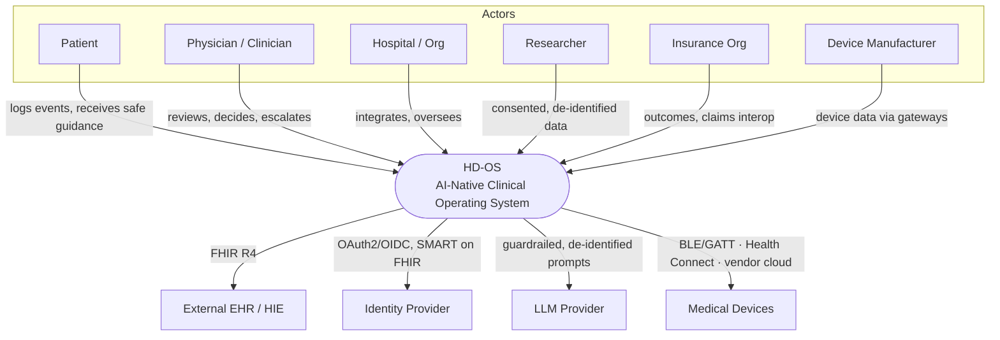

# HD-OS System Architecture

> **Document 004 of the HD-OS documentation suite.**
> The end-to-end technical architecture: the C4 views, the ratified technology
> stack, the disease-agnostic **core** vs pluggable **disease modules**, the three
> platform engines (**CKE / CDE / DTE**), the FHIR data plane, the security and AI
> planes, deployment topology, and the **ADR index**. Read after the Meta Spec
> (`HDOS-DOC-000`) and Constitution (`HDOS-DOC-002`); it is the third document in
> the Prime-Directive read order and the last foundational gate before module
> specifications and code.

---

## Document Control

| Field | Value |
|-------|-------|
| **Document ID** | `HDOS-DOC-004` |
| **Title** | HD-OS System Architecture |
| **Type** | Architecture (foundational) |
| **Version** | `1.0.0` |
| **Status** | `DRAFT` |
| **Owner** | Head of Engineering |
| **Approvers** | Head of Engineering · Security & Privacy Officer · CMO (clinical planes) |
| **Related** | `HDOS-DOC-000` Meta Spec · `-001` CLAUDE.md · `-002` Constitution · `-005` Clinical-Architecture · `-006` Database-Architecture · `-007` FHIR · `-009` Security · `-010` AI-System |
| **ADR location** | [`docs/adr/`](./adr/README.md) |

> ⚕️ **Positioning honesty.** Architecture readiness is not a clinical claim; the
> clinical/regulatory gates (CLAUDE.md §5/§20; Meta Spec Ch. 13) remain
> prerequisites to any clinical labelling.

---

## 1. Architectural Goals & Drivers

Derived from Meta Spec Ch. 2 (engineering philosophy) and Ch. 15 (success), in
priority order when they tension:

1. **Clinical safety** — deterministic safety planes independent of models (§6).
2. **Security & privacy** — PHI protected end-to-end; least privilege; auditable.
3. **Explainability** — every clinical/AI output traceable to knowledge + data.
4. **Interoperability** — FHIR-native, contract-first, portable.
5. **Extensibility (MDPF)** — disease-agnostic core; modules plug in (§8, Ch. 16).
6. **Testability, maintainability, scalability, performance** — in that order.

**Architecture principles** are the normative source in CLAUDE.md §4
(`HD-STD-CODE-0020`…`0028`): hexagonal core + adapters, domain-driven boundaries,
FHIR-native, offline-first, security/privacy by design, deterministic safety
layer, evolvability, observability. This document applies them; it does not restate
them.

## 2. C4 — Level 1: System Context



The core boundary of HD-OS is drawn so that **all clinical knowledge and
disease-specificity live inside governed subsystems** (CKE/CDE + modules), never in
the edges (apps, gateways, prompts) — Meta Spec Ch. 10.

## 3. C4 — Level 2: Containers

```mermaid
graph LR
  subgraph Apps
    MOB[Flutter Patient App<br/>offline-first]
    WEB[Clinician Web Panel<br/>React + Material 3]
    ADM[Research/Admin Web]
  end

  subgraph Edge
    BFF[API Gateway / BFF<br/>authN/Z, consent, rate-limit]
  end

  subgraph Core Services (disease-agnostic)
    IDS[Identity & Consent]
    DATA[Clinical Data Plane<br/>FHIR R4 + audit]
    NTF[Notifications]
    SEC[Security & Audit]
  end

  subgraph Clinical & AI Engines
    CKE[CKE — Clinical Knowledge Engine]
    CDE[CDE — Clinical Decision Engine]
    DTE[DTE — Digital Twin Engine]
    AIC[AI Coach + AI Pipeline<br/>guardrails · explainability]
  end

  subgraph Integration
    DGW[Device Gateway<br/>BLE/GATT · Health Connect]
  end

  subgraph Disease Modules (pluggable)
    DM[DM — Diabetes]
    CKD[CKD]
    MORE[…future modules]
  end

  DBs[(PostgreSQL<br/>encrypted PHI + audit chain)]

  MOB --> BFF --> IDS
  WEB --> BFF
  ADM --> BFF
  BFF --> DATA --> DBs
  BFF --> CDE
  CDE --> CKE
  CDE --> DTE
  AIC --> CDE
  AIC --> LLM[(LLM Provider)]
  DGW --> DATA
  DM -. knowledge .-> CKE
  CKD -. knowledge .-> CKE
  DATA --> SEC
```

**Rule:** disease modules contribute **knowledge and module specs** into CKE and
reference core services; they do **not** fork the core (Constitution Art. VIII;
Meta Spec Ch. 16).

## 4. The Three Platform Engines

| Engine | Prefix | Responsibility | Governing flow |
|--------|--------|----------------|----------------|
| **CKE** Clinical Knowledge Engine | `CKE_` | Ingests guideline-sourced, clinically-reviewed knowledge; stores versioned clinical rules. Knowledge never bypasses it. | Meta Spec Ch. 10 |
| **CDE** Clinical Decision Engine | `CDE_` | Applies clinical rules deterministically to patient state; produces explainable, guideline-cited outputs and red-flag escalations. | Meta Spec Ch. 10; `HD-CLIN-PLAT-000001` |
| **DTE** Digital Twin Engine | `DTE_` | Maintains the patient's continuously-updated model from the event timeline; feeds disease/prediction/risk/personalization. | Meta Spec Ch. 12 |

`HD-STD-CODE-0026` (deterministic safety layer) binds CDE: red-flag/hard-block
logic is deterministic and independent of the AI plane.

## 5. AI Plane

Implements Meta Spec Ch. 11 exactly:

```
Raw Data → Validation → Feature Store → Prediction → Explainability
→ Clinical Review Layer → Recommendation → Patient
```

- Guardrails (deterministic) wrap every model call, in and out (CLAUDE.md §6).
- No PHI leakage into prompts; provider under BAA/DPA (`HD-STD-AI-0005`).
- Eval gates (safety recall, groundedness, injection resistance) block release
  (`HD-STD-AI-0008`; `HD-TEST-CDE-000001`).

## 6. Data Plane (FHIR-native)

- Canonical model: **FHIR R4** (`Patient`, `Observation`, `Condition`,
  `MedicationStatement`, `CarePlan`, `Device`, `Consent`, `Provenance`, `Flag`).
- Terminologies: LOINC/SNOMED/ICD/UCUM/RxNorm — never invented (CLAUDE.md §11).
- Clinical records are **append-only**; corrections supersede (Constitution
  Art. II.8; CLAUDE.md §5, §10).
- PHI encrypted at rest (field-level AES-256-GCM for the most sensitive) +
  tamper-evident hash-chained audit (CLAUDE.md §10, §13). Details in `HDOS-DOC-006`.

## 7. Security & Privacy Plane

Overview here; normative detail in `HDOS-DOC-009` and CLAUDE.md §13.

- **Edge:** authN/Z, consent-gating, rate-limiting at the BFF; nothing public by
  default.
- **Identity:** OAuth2/OIDC; SMART on FHIR for clinical interop; short-lived
  least-privilege tokens.
- **Data:** encryption in transit (TLS 1.2+) and at rest; KMS-managed keys;
  no PHI in logs/prompts/non-prod.
- **Audit:** every PHI access/change recorded (hash-chained), sufficient for HIPAA
  audit and breach investigation.
- **SDLC gates:** SAST, SCA, secret-scanning in CI; DAST for major releases.

## 8. Modularity & the MDPF

`HDOS-ARCH-MOD-01` The **core** (identity, consent, data plane, security, audit,
CKE/CDE/DTE runtime, AI guardrails, i18n/RTL, a11y) contains **zero
disease-specific logic**. A **disease module** is a package that provides: (a)
CKE knowledge (guideline-sourced, reviewed), (b) module requirement specs with
`HD-*-<DOMAIN>-*` IDs, (c) FHIR profiles/value-sets it needs, (d) UI surfaces
composed from core widgets. Adding a module never edits the core — the
architectural guarantee behind Meta Spec Ch. 15 and the MDPF (Ch. 16).

## 9. Ratified Technology Stack (via ADR)

The following are **ratified** here and recorded as ADRs (§10). Changes require an
ADR superseding the original (never silent edits).

| Layer | Choice | ADR |
|-------|--------|-----|
| Patient app | **Flutter / Dart** (stable) | ADR-0001 |
| App state | **Riverpod** (single sanctioned solution, CLAUDE.md §8) | ADR-0001 |
| Clinician/admin web | **React + TypeScript**, Material 3 tokens shared | ADR-0001 |
| Backend services | **TypeScript on Node (strict)**, typed HTTP framework | ADR-0001 |
| Service shape | **Hexagonal**: pure `core/` + `infra/` adapters + thin entry | ADR-0002 |
| Database | **PostgreSQL**, forward-only migrations, field-level PHI encryption | ADR-0001 |
| Clinical model | **HL7 FHIR R4** + standard terminologies | ADR-0001 |
| Auth | **OAuth2 / OIDC**, SMART on FHIR | ADR-0001 |
| CI gate | typecheck + lint + unit/integration + **safety-evals** must be green | ADR-0002 |

> Rationale summary: this stack matches the proven patterns already validated in
> the seed prototype (pure typed service cores + adapters; FHIR-native; offline
> patient app), minimising novel risk while meeting the drivers in §1.

## 10. Architecture Decision Records (ADR) Index

ADRs live in [`docs/adr/`](./adr/README.md) and follow the format
context → decision → alternatives → consequences (CLAUDE.md §18
`HD-STD-DOC-0005`). Seed ADRs:

| ADR | Title | Status |
|-----|-------|--------|
| [ADR-0001](./adr/0001-technology-stack.md) | Ratify the HD-OS technology stack | Accepted (draft) |
| [ADR-0002](./adr/0002-hexagonal-core.md) | Hexagonal core + adapters for all services | Accepted (draft) |

New significant decisions add the next ADR number (immutable, never reused).

## 11. Deployment & Environments

- Environments: **dev → staging → production** with gated promotion; production PHI
  never flows backward (CLAUDE.md §13 `HD-STD-SEC-0012`).
- Progressive delivery: feature flags / canary for risky changes; tested one-step
  rollback per release (Meta Spec Ch. 13; CLAUDE.md §20).
- Observability: structured PHI-free logs, metrics, traces; health/readiness
  endpoints; post-market monitoring and field-safety path.

## 12. Cross-references

Architecture principles: CLAUDE.md §4. Clinical plane detail: `HDOS-DOC-005`.
Data/schema detail: `HDOS-DOC-006`. FHIR profiles: `HDOS-DOC-007`. Security:
`HDOS-DOC-009`. AI system: `HDOS-DOC-010`. This document is subordinate to the Meta
Spec and Constitution; on conflict, the safety-higher rule governs (CLAUDE.md §0.3).

---

## Revision History

| Version | Date | Author (role) | Change |
|---------|------|---------------|--------|
| 1.0.0 | (draft) | Head of Engineering | Initial architecture: C4 L1/L2, engines (CKE/CDE/DTE), AI/data/security planes, modularity/MDPF, ratified stack, ADR index, deployment. |

<!-- END OF HDOS-DOC-004. Third in the read order; foundational gate before module specs/code. -->
